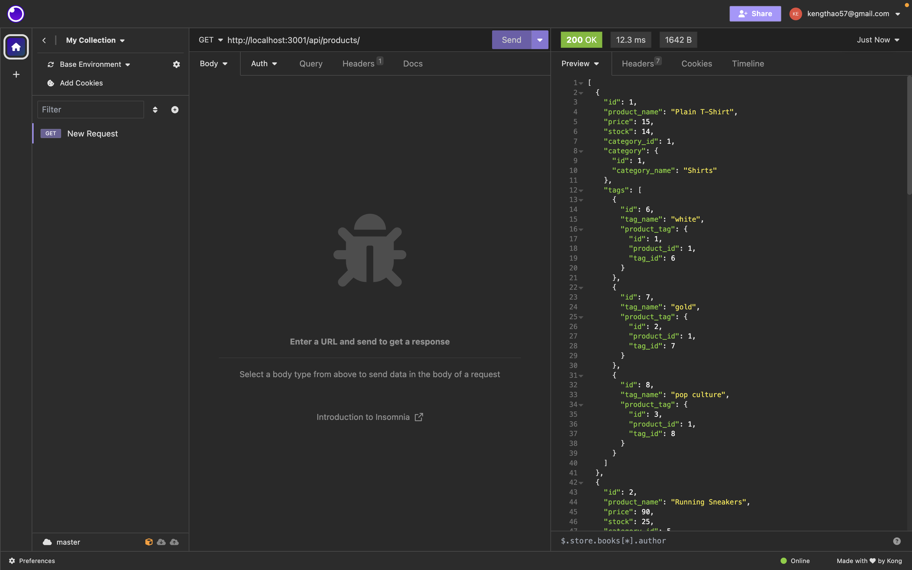

# E-commerce Back End Starter Code

## Description
Starter code was provided to create a application for an e-commerce company. This application build a application for the backend of a website and it work by using Express as well as sequelize and mySQL to make it convinent to engage in buying and selling products online. 

[Link to Github Repository](https://github.com/Kthao29/cyber_mall)

## User Story

AS A manager at an internet retail company

I WANT a back end for my e-commerce website that uses the latest technologies

SO THAT my company can compete with other e-commerce companies

## Acceptance Criteria

GIVEN a functional Express.js API

WHEN I add my database name, MySQL username, and MySQL password to an environment variable file

THEN I am able to connect to a database using Sequelize

WHEN I enter schema and seed commands

THEN a development database is created and is seeded with test data

WHEN I enter the command to invoke the application

THEN my server is started and the Sequelize models are synced to the MySQL database

WHEN I open API GET routes in Insomnia Core for categories, products, or tags

THEN the data for each of these routes is displayed in a formatted JSON

WHEN I test API POST, PUT, and DELETE routes in Insomnia Core

THEN I am able to successfully create, update, and delete data in my database

## Screenshots/Vid

Videos are in folder

## Usage/Installation

1. npm init
2. install mysql2
3. install sequelize
4. install express
5. install dotenv
6. mysql -u root -p
7. source db/schema.sql and then control z to exit mysql
8. npm run seed
9. npm start
10. put localhost into insomnia

## Credits 

1. VS Code
2. mysql2
3. sequelize
4. express
5. dotenv
6. github
7. insomnia
8. UW class activities

## Author

My Github account: https://github.com/Kthao29

